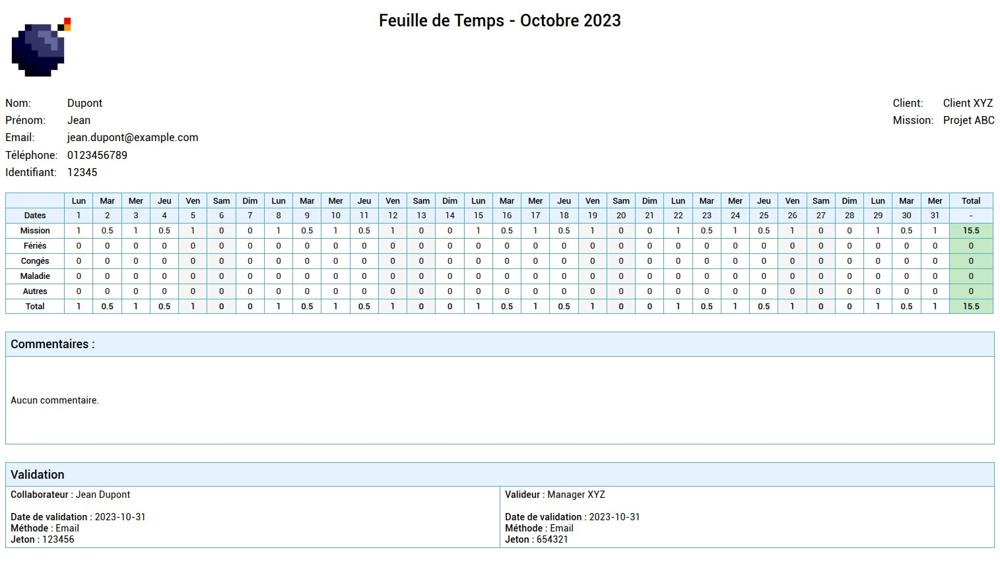

# LogiMinder Timesheet PDF

LogiMinder Timesheet PDF est une API pour générer des feuilles de temps au format PDF à partir de données JSON. Elle est utile pour les consultants, managers et entreprises souhaitant automatiser et simplifier la création de rapports de temps.



## Fonctionnalités principales

- **Génération de PDF** : Produisez des feuilles de temps détaillées et adaptées à vos besoins.
- **Validation des données** : Vérification stricte des données JSON pour garantir leur intégrité.
- **Personnalisation** : Ajoutez un logo (en base64), des informations sur les consultants et les clients, des commentaires et des tableaux.
- **Support multi-langue** : Génération de documents en plusieurs langues (anglais, français, espagnol, portugais, allemand, italien, arabe).
- **Visualisation des totaux** : Résumé clair des heures travaillées, des congés et d'autres informations pertinentes.

## Installation

### Pré-requis
- Node.js (v16 ou plus récent)
- Docker (optionnel, pour une exécution conteneurisée)

### Lancer avec Node.js

1. Clonez le dépôt :
   ```bash
   git clone https://github.com/votre-repo/logiminder-timesheet-pdf.git
   cd logiminder-timesheet-pdf
   ```

2. Installez les dépendances :
   ```bash
   npm install
   ```

3. Lancez le serveur :
   ```bash
   node server.js
   ```

4. Accédez à l'API sur `http://localhost:3000`.

### Lancer avec Docker

1. Construisez l'image Docker :
   ```bash
   docker build -t logiminder-timesheet .
   ```

2. Lancez le conteneur :
   ```bash
   docker run -p 3000:3000 logiminder-timesheet
   ```

3. Accédez à l'API sur `http://localhost:3000`.

### Lancer avec Docker Compose

1. Démarrez l'application avec :
   ```bash
   docker-compose up
   ```

2. Accédez à l'application sur `http://localhost:3000`.

## Utilisation de l'API

### Exemple d'appel avec `curl`

#### Génération de PDF

Envoyez une requête POST à l'API :
```bash
curl -X POST http://localhost:3000/generate-pdf \
  -H "Content-Type: application/json" \
  -d '{
    "language": "fr",
    "callData": {
      "logo": "data:image/jpeg;base64,****",
      "month": "Décembre",
      "year": "2023",
      "consultant": {
        "name": "Dupont",
        "firstName": "Jean",
        "email": "jean.dupont@example.com",
        "phone": "0123456789",
        "identifier": "12345"
      },
      "client": "Client XYZ",
      "mission": "Projet ABC",
      "table": {
        "header": ["Lun", "Mar", "Mer", "Jeu", "Ven", "Sam", "Dim", "Lun", "Mar", "Mer", "Jeu", "Ven", "Sam", "Dim", "Lun", "Mar", "Mer", "Jeu", "Ven", "Sam", "Dim", "Lun", "Mar", "Mer", "Jeu", "Ven", "Sam", "Dim", "Lun", "Mar", "Mer"],
        "dates": ["1", "2", "3", "4", "5", "6", "7", "8", "9", "10", "11", "12", "13", "14", "15", "16", "17", "18", "19", "20", "21", "22", "23", "24", "25", "26", "27", "28", "29", "30", "31"],
        "mission": ["1", "0.5", "1", "0.5", "1", "0", "0", "1", "0.5", "1", "0.5", "1", "0", "0", "1", "0.5", "1", "0.5", "1", "0", "0", "1", "0.5", "1", "0.5", "1", "0", "0", "1", "0.5", "1"],
        "holidays": ["0", "0", "0", "0", "0", "0", "0", "0", "0", "0", "0", "0", "0", "0", "0", "0", "0", "0", "0", "0", "0", "0", "0", "0", "0", "0", "0", "0", "0", "0", "0"],
        "leaves": ["0", "0", "0", "0", "0", "0", "0", "0", "0", "0", "0", "0", "0", "0", "0", "0", "0", "0", "0", "0", "0", "0", "0", "0", "0", "0", "0", "0", "0", "0", "0"],
        "sickLeave": ["0", "0", "0", "0", "0", "0", "0", "0", "0", "0", "0", "0", "0", "0", "0", "0", "0", "0", "0", "0", "0", "0", "0", "0", "0", "0", "0", "0", "0", "0", "0"],
        "others": ["0", "0", "0", "0", "0", "0", "0", "0", "0", "0", "0", "0", "0", "0", "0", "0", "0", "0", "0", "0", "0", "0", "0", "0", "0", "0", "0", "0", "0", "0", "0"],
        "total": ["1", "0.5", "1", "0.5", "1", "0", "0", "1", "0.5", "1", "0.5", "1", "0", "0", "1", "0.5", "1", "0.5", "1", "0", "0", "1", "0.5", "1", "0.5", "1", "0", "0", "1", "0.5", "1"]
      },
      "totals": {
        "header": "Total",
        "values": ["15.5", "0", "0", "0", "0", "15.5"]
      },
      "comments": "Aucun commentaire.",
      "validations": {
        "employee": {
          "name": "Jean Dupont",
          "validationDate": "2023-12-31",
          "method": "Email",
          "token": "123456"
        },
        "approver": {
          "name": "Manager XYZ",
          "validationDate": "2023-12-31",
          "method": "Email",
          "token": "654321"
        }
      }
    }
  }'
```

### Notes sur les champs

- **`language`** : Langue du document, doit être l'un des codes supportés :
  - `fr` : Français
  - `en` : Anglais
  - `es` : Espagnol
  - `pt` : Portugais
  - `de` : Allemand
  - `it` : Italien
  - `ar` : Arabe
- **`logo`** : Image du logo au format base64. Utilisez un outil comme [Base64-Image](https://www.base64-image.de/) pour convertir vos fichiers.
- **`month` et `year`** : Mois et année du rapport (ex. : "Décembre", "2023").
- **`consultant`** : Informations sur le consultant (nom, prénom, email, téléphone et identifiant).
- **`client`** : Nom du client.
- **`mission`** : Nom du projet ou mission.
- **`table`** : Données tabulaires (en-têtes, dates, valeurs par jour).
- **`totals`** : Résumé des totaux.
- **`comments`** : Commentaires supplémentaires.
- **`validations`** : Informations sur les validations effectuées par le consultant et l'approbateur.

## Licence

Ce projet est sous licence MIT. Consultez le fichier `LICENSE` pour plus d'informations.

## Crédit

Développé avec ❤️ par **drslid**.

---

Pour toute question ou suggestion, ouvrez une issue sur le dépôt GitHub ou contactez-moi directement.

