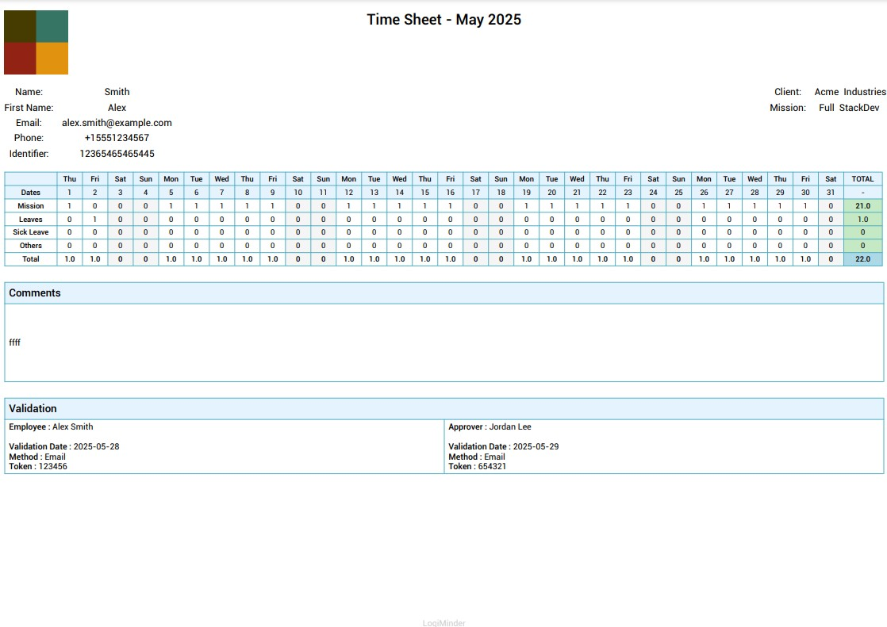

 [](https://github.com/drslid/LogiMinder_Timesheet_PDF/graphs/contributors) [  ](https://github.com/drslid/LogiMinder_Timesheet_PDF/stargazers) [  ](https://github.com/drslid/LogiMinder_Timesheet_PDF/network/members) [](https://github.com/drslid/LogiMinder_Timesheet_PDF/issues) 

# 📑 LogiMinder Timesheet PDF 🗓️

**LogiMinder Timesheet PDF** is a lightweight Node.js API for generating professional timesheet PDFs from structured JSON data. It supports multiple languages, strict schema validation, and customizable layouts.

   

<p align="center">
  
</p>


## 📖 Table of Contents

- [✨ Key Features](#-key-features)  
- [🛠️ Prerequisites](#prerequisites)  
- [📋 Getting Started](#getting-started)
  - [Clone the Repository](#clone-the-repository)  
  - [Install Dependencies](#install-dependencies)  
  - [Run Locally with Node.js](#run-locally-with-nodejs)  
  - [Run with Docker](#run-with-docker)  
  - [Run with Docker Compose](#run-with-docker-compose)  
- [📡 API Usage](#api-usage)
  - [Endpoint](#endpoint)  
  - [Payload Structure](#payload-structure)  
  - [Example Request](#example-request)  
  - [Field Notes](#field-notes)  
  - [JSON Validation](#json-validation)  
- [📄 PDF Structure](#pdf-structure)  
- [🤝 Contributing](#contributing)  
- [👥 Contributors](#contributors)  
- [📜 License](#license)


## ✨ Key Features

-   📄 **Dynamic PDF Generation**: Creates professional timesheet PDFs with consultant info, client details, daily time tracking, and validation sections.
-   🌍 **Multilingual Support**: Supports English (`en`), French (`fr`), Spanish (`es`), Portuguese (`pt`), German (`de`), Italian (`it`), and Arabic (`ar`).
-   🧪 **Strict JSON Validation**: Uses AJV to enforce a robust schema for consistent input data.
-   🖼️ **Customizable Logo**: Supports base64-encoded images (JPEG, PNG, GIF) for branding.
-   📊 **Time Tracking**: Tracks mission, leaves, sick leave, and other activities with daily and total summaries.
-   🐳 **Docker Support**: Easy deployment with Docker and Docker Compose.
-   🎨 **Styled Layout**: Color-coded headers, weekends, and totals for improved readability.

## 🛠️ Prerequisites

-   **Node.js** (v16 or newer) for local development.
-   **Docker** (optional) for containerized deployment.
-   **Fonts**: Ensure `Roboto` and `Amiri` fonts are available in the `fonts/` directory (included in the repository).
-   **Git** to clone the repository.

## 📋 Getting Started

### Clone the Repository

```bash
git clone https://github.com/drslid/LogiMinder_Timesheet_PDF.git
cd LogiMinder_Timesheet_PDF

```

### Install Dependencies

```bash
npm install

```

### Run Locally with Node.js

```bash
node server.js

```

The API will be available at `http://localhost:3000`.

### Run with Docker

1.  Build the Docker image:
    
    ```bash
    docker build -t logiminder-timesheet .
    
    ```
    
2.  Run the container:
    
    ```bash
    docker run -p 3000:3000 logiminder-timesheet
    
    ```
    
3.  Access the API at `http://localhost:3000`.

### Run with Docker Compose

```bash
docker-compose up --build

```

The API will be available at `http://localhost:3000`.

## 📡 API Usage

### Endpoint

-   **Method**: `POST /generate-pdf`
-   **Content-Type**: `application/json`
-   **Response**: Binary PDF file (`application/pdf`)

### Payload Structure

The API expects a JSON payload with the following structure:

```json
{
  "language": "string",
  "callData": {
    "logo": "string",
    "date": "string",
    "consultant": {
      "name": "string",
      "firstName": "string",
      "email": "string",
      "phone": "string",
      "identifier": "string"
    },
    "client": "string",
    "mission": "string",
    "table": {
      "mission": ["string"],
      "leaves": ["string"],
      "sickLeave": ["string"],
      "others": ["string"]
    },
    "comments": "string",
    "validations": {
      "employee": {
        "name": "string",
        "validationDate": "string",
        "method": "string",
        "token": "string"
      },
      "approver": {
        "name": "string",
        "validationDate": "string",
        "method": "string",
        "token": "string"
      }
    }
  }
}

```

### Example Request

```bash
curl -X POST http://localhost:3000/generate-pdf \
  -H "Content-Type: application/json" \
  -d '{
    "language": "en",
    "callData": {
      "logo": "data:image/png;base64,iVBORw0KGgoAAAANSUhEUgAAADwAAAA8CAIAAAC1nk4lAAAAgElEQVR4nOzQMQ3CYBhFUUJ+AyjABgMzCwsWEFhdXSuhKr6bNDlHwMvNW5/3/TbjeP2HlqeKR4muiK6IroiuiK6IroiuiK6IroiuiK6IroiuiK6s7/4Ymv49t6HlSz4tuiK6IroiuiK6IroiuiK6IroiuiK6IroiuiK6cgYAAP//ImUE6VlfCnoAAAAASUVORK5CYII=",
      "date": "05/2025",
      "consultant": {
        "name": "Smith",
        "firstName": "Alex",
        "email": "alex.smith@example.com",
        "phone": "+15551234567",
        "identifier": "12365465465445"
      },
      "client": "Acme Industries",
      "mission": "Full-Stack Dev",
      "table": {
        "mission": ["2:0"],
        "leaves": ["2:1"],
        "sickLeave": [],
        "others": []
      },
      "comments": "Project on track.",
      "validations": {
        "employee": {
          "name": "Alex Smith",
          "validationDate": "2025-05-31",
          "method": "Email",
          "token": "123456"
        },
        "approver": {
          "name": "Jordan Lee",
          "validationDate": "2025-05-31",
          "method": "Email",
          "token": "654321"
        }
      }
    }
  }' > timesheet.pdf

```

### Field Notes

-   **`language`**: Must be one of `en`, `fr`, `es`, `pt`, `de`, `it`, `ar`.
-   **`logo`**: Base64-encoded image (JPEG, PNG, or GIF). Use tools like [Base64-Image](https://www.base64-image.de/) to convert images.
-   **`date`**: Format `MM/YYYY` (e.g., `05/2025`).
-   **`consultant`**: Required fields: `name`, `firstName`, `email`. Optional: `phone`, `identifier`.
-   **`client`**: Client name (max 100 characters).
-   **`mission`**: Project or mission name (max 100 characters).
-   **`table`**: Arrays of day pointers in format `DAY:VALUE` (e.g., `2:0.5`):
    -   `mission`: Values `0`, `0.5`, `1`.
    -   `leaves`, `sickLeave`, `others`: Values `0.5`, `1`.
-   **`comments`**: Optional comments (max 1000 characters).
-   **`validations`**: Employee and approver details, including `name`, `validationDate` (YYYY-MM-DD), `method` (Email, SMS, Other), and `token`.

### JSON Validation

The API uses AJV to validate incoming JSON against a schema (`schema.js`). Invalid payloads return a `400` error with detailed validation errors, ensuring consistent PDF output.

## 📄 PDF Structure

The generated PDF includes:

-   **Header**: Logo (top-left), title with month and year (center).
-   **Consultant Info**: Name, first name, email, phone, identifier (left).
-   **Client Info**: Client name, mission (right).
-   **Table**: Displays days of the month, with rows for mission, leaves, sick leave, others, and daily totals. Weekends are highlighted.
-   **Comments**: Optional section with user-provided comments.
-   **Validation**: Employee and approver details (name, date, method, token).
-   **Footer**: "LogiMinder" branding.

## 🤝 Contributing

Contributions are welcome! Here's how you can help:

1.  **Report Issues**: Open an issue for bugs or suggestions.
2.  **Submit Pull Requests**:
    -   Fork the repository.
    -   Create a branch: `git checkout -b feature/your-feature`.
    -   Commit changes: `git commit -m "Add your feature"`.
    -   Push to your fork: `git push origin feature/your-feature`.
    -   Open a pull request.

## 👥 Contributors

<a href="https://github.com/drslid/EvPortal/graphs/contributors">
  
</a>

## 📜 License

This project is licensed under the MIT License. 

<p align="right"><a href="#top">⬆️ Back to top</a></p>

----------

Build to automate timesheets. Generate clean, multilingual reports. 📄🌍🚀